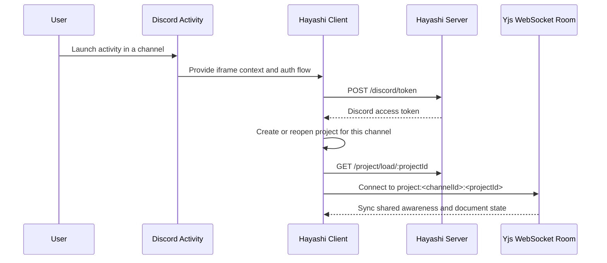
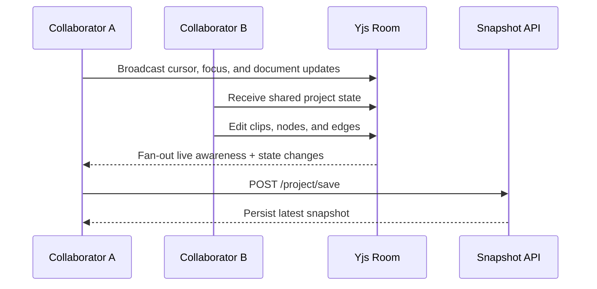

<div align="center">
  

  <h1>Hayashi</h1>
  <p><strong>A collaborative browser music lab built for Discord Activities</strong></p>

  [](https://www.typescriptlang.org/)
  [](https://react.dev/)
  [](https://yjs.dev/)
  [](LICENSE.md)
</div>

---

## Overview

Hayashi is a multiplayer music workspace for Discord Activities. It combines a **shared patch canvas**, a **browser-based audio engine**, and **live room presence** so everyone in a channel can build loops, route signals, and shape ideas together in real time.

The app is organized as a small monorepo: a **React/Vite client** in `apps/client` and a **Hono + WebSocket server** in `apps/server`. Collaboration is powered by **Yjs**, project snapshots are persisted server-side, and rendered audio stays local in the browser.

---

## Studio Experience

The main workspace is designed around three core surfaces: the patch canvas for building signal flow, the asset rail for samples and node details, and the floating presence rail for collaborators in the room.

| Surface | Description |
|----------|-------------|
| Patch canvas | Drag nodes, connect edges, and build the live signal graph |
| Asset library | Browse uploaded audio and workspace assets |
| Node inspector | Edit the currently selected node inline from the footer |
| Presence rail | See Discord participants, cursors, and session awareness |
| Export panel | Render the current scene to a stereo WAV file |

### Session Flow



### What Happens In A Room



| Workflow | Description |
|----------|-------------|
| New room creation | Generates a project ID and names the session from the current user |
| Presence merging | Combines Discord participants with Yjs awareness state |
| Snapshot restore | Loads the latest saved project state when reopening a room |
| Local rendering | Audio playback and offline export run in the client |

---

## Architecture

Hayashi is split into a client app and a lightweight real-time backend.

### Packages

| Package | Role |
|----------|------|
| `apps/client` | React 19 + Vite UI, audio engine, patch editor, export flow |
| `apps/server` | Hono HTTP API, static asset serving, Discord token exchange, Yjs WebSocket host |

### Client Highlights

| Area | Notes |
|------|-------|
| Audio engine | Browser-side transport, graph compilation, scheduled playback, offline bounce |
| Patching UI | `@xyflow/react` canvas with node editors and connection management |
| Collaboration | `yjs` + `y-websocket` awareness for cursors, focus, and shared state |
| State management | Zustand store for project, transport, assets, clips, nodes, and tracks |
| Discord integration | Embedded App SDK support with local dev fallbacks outside the iframe |

### Server Highlights

| Area | Notes |
|------|-------|
| API framework | Hono running on Node via `@hono/node-server` |
| Real-time sync | `ws` + `y-websocket` shared document rooms |
| Persistence | Snapshot JSON and uploaded assets stored under `/tmp/hayashi` |
| Static serving | Serves the built client app and runtime assets from `apps/client/dist` |

---

## Full API Reference

### Health & Auth

| Method | Path | Description |
|--------|------|-------------|
| `GET` | `/health` | Returns service status and current mode |
| `POST` | `/discord/token` | Exchanges a Discord authorization code for an access token |

### Project Persistence

| Method | Path | Description |
|--------|------|-------------|
| `POST` | `/project/save` | Saves the latest project snapshot for a room |
| `GET` | `/project/load/:projectId` | Loads the most recent saved snapshot |

### Assets

| Method | Path | Description |
|--------|------|-------------|
| `POST` | `/assets/upload` | Uploads raw asset bytes and returns an asset ID |
| `GET` | `/assets/:assetId` | Serves an uploaded asset or bundled client asset |

### App Hosting

| Method | Path | Description |
|--------|------|-------------|
| `GET` | `/*` | Serves the built SPA and falls back to `index.html` for client routes |
| `WS` | `/:docName` | Hosts a Yjs collaboration room for the requested document name |

---

## Project Layout

### Client

| Path | Purpose |
|------|---------|
| `apps/client/src/components` | Studio UI, editors, inspectors, and activity entry screens |
| `apps/client/src/audio` | Runtime engine, transport scheduling, and graph compilation |
| `apps/client/src/export` | Offline WAV bounce |
| `apps/client/src/hooks` | Discord, Yjs, transport, and audio lifecycle hooks |
| `apps/client/src/stores` | Shared Zustand project store |

### Server

| Path | Purpose |
|------|---------|
| `apps/server/src/routes.ts` | HTTP routes and static file handling |
| `apps/server/src/server.ts` | Node server bootstrap and WebSocket server |
| `apps/server/src/yjs` | Yjs connection wiring |

---

## Getting Started

### Prerequisites

- Node.js 20+
- npm or another workspace-aware package manager
- A Discord application configured for Activities if you want to run inside Discord

### Installation

```bash
git clone https://github.com/jdbohrman/hayashi.git
cd hayashi
npm install
```

### Configuration

Create env files for the client and server. The repository includes a root `.env.example` with the expected keys.

```bash
# apps/client/.env
VITE_DISCORD_CLIENT_ID=your_discord_client_id
VITE_SERVER_URL=http://localhost:3001

# apps/server/.env
DISCORD_CLIENT_ID=your_discord_client_id
DISCORD_CLIENT_SECRET=your_discord_client_secret
SERVER_PORT=3001
```

If you launch the client outside Discord, the app falls back to local dev mode and can read `channel_id`, `guild_id`, `user_id`, and `username` from the URL query string.

### Development

```bash
npm run dev
```

That runs the monorepo dev pipeline. If you need package-level commands:

```bash
npm --workspace @hayashi/client run dev
npm --workspace @hayashi/server run dev
```

### Build

```bash
npm run build
```

### Test

```bash
npm run test
npm run lint
```

---

## Notes

### Persistence Model

Project snapshots and uploaded assets currently live on the server filesystem under `/tmp/hayashi`. That is fine for local development and demos, but it is not durable production storage.

### Discord Activity Constraints

When Hayashi runs inside the Discord iframe, the client uses the page origin for HTTP and WebSocket traffic so it stays within the activity CSP model.

### Local Audio

Playback and export are rendered locally in the browser. Shared collaboration state is synchronized over Yjs, but audio output itself is not streamed between participants.

---

## License

Commercial proprietary software — see [LICENSE.md](LICENSE.md) for the End User License Agreement.
